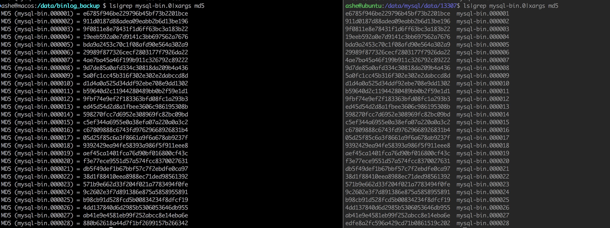

# virtual_slave

更确切的来说，应该叫做MySQL virtual slave，virtual_slave是一个远程binlog同步工具，
并且提供类似于semisync slave的功能，返回ACK给master。
> virtual_slave也将会是MyKeeper的重要组件，来实现MySQL数据库实现同机房或者跨机房的
高可用。

## 一、功能列表

已经支持的功能列表
- 支持GTID同步模式
- 支持FILE+POS同步模式
- 支持半同步复制
- 支持断点续传
- 支持设置binlog落盘模式
- 支持心跳间隔设置
- 支持网络超时设置

将来会支持的功能列表

- 设置binlog文件过期时间，自动进行binlog的purge操作。
- 较好的日志打输出，之前在项目中一般使用spdlog，但是它只能支持C++11，考虑到兼容性问题，打算使用
MySQL自身提供的日志组件。

## 二、安装使用

可以使用源码安装，或者直接下载对应的二进制文件。推荐直接下载二进制文件，因为编译好的
virtual_slave二进制文件不依赖其它第三方库文件，拿来即用。

## 二进制安装

```$xslt
wget 
```


### 源码安装
源码编译的话，依赖MySQL-5.7.18或者更高的5.7版本的MySQL源代码，请提前下载

```$xslt
#下载virtual_slave源代码
git glone https://github.com/sunashe/virtual_slave.git

#
```

### 配置文件示例

配置文件超级简单。

```$xslt
#virtual_slave同步binlog模式，0/1 GTID; 2 binlog file+pos.
#0:decide by exclude_gtids(clean binlog_dir);
#1:decide by "show master status"(clean binlog_dir);
#2:decide by last file and pos in binlog_dir;
get_start_gtid_mode=2

# 指定不需要同步的GTID，如果为空，则从master已有的最旧的binlog文件开始同步。
exclude_gtids=
virtual_slave_server_id=123456
master_host=10.211.55.32
master_port=13307
master_user=ashe
master_password=ashe

#binlog的目录
binlog_dir=/data/binlog_backup

#心跳间隔
heartbeat_period = 5

#网络超时时间，要大于心跳间隔，不然在写入低峰期virtual_slave会尝试重连。
net_read_time_out = 10
```

### 启动示例
```$xslt
nohup virtual_slave  /etc/123_virtual_slave.cnf &
```
查看启动日志
```asm
cat virtual_slave.log
2019-01-31T15:07:18.620931+08:00 0 [Note] current work dir /data/binlog_backup/100.106.30.3_13307
2019-01-31T15:07:18.645936+08:00 0 [Note] connect to master first times,master_uuid:1c78a195-b077-11e6-9a8f-246e9601e1c8
2019-01-31T15:07:18.646548+08:00 0 [Warning] Master server does not support semi-sync, fallback to asynchronous replication
2019-01-31T15:07:18.648559+08:00 0 [ERROR] Got error reading packet from server: 1236,The slave is connecting using CHANGE MASTER TO MASTER_AUTO_POSITION = 1, but the master has purged binary logs containing GTIDs that the slave requires.
2019-01-31T15:07:18.654630+08:00 0 [Note] reconnect to master,master_uuid:1c78a195-b077-11e6-9a8f-246e9601e1c8
2019-01-31T15:07:18.654645+08:00 0 [Note] M-S does not switch
2019-01-31T15:07:18.655107+08:00 0 [Warning] Master server does not support semi-sync, fallback to asynchronous replication
2019-01-31T15:40:25.355271+08:00 0 [ERROR] Got error reading packet from server: 2013,Lost connection to MySQL server during query
2019-01-31T15:40:25.373087+08:00 0 [Note] reconnect to master,master_uuid:1c78a195-b077-11e6-9a8f-246e9601e1c8
2019-01-31T15:40:25.373126+08:00 0 [Note] M-S does not switch
2019-01-31T15:40:25.373652+08:00 0 [Warning] Master server does not support semi-sync, fallback to asynchronous replication
```

### master上查看
通过show processlist可以看到dump线程。
通过show slave hosts可以看到virtual_slave更详细的信息。其中slave_uuid固化在了代码中，后期打算拆到配置文件中。
```asm
mysql> show processlist;
+-------+------+-------------------+------+------------------+------+---------------------------------------------------------------+------------------+
| Id    | User | Host              | db   | Command          | Time | State                                                         | Info             |
+-------+------+-------------------+------+------------------+------+---------------------------------------------------------------+------------------+
|   133 | root | localhost         | ashe | Query            |    0 | starting                                                      | show processlist |
| 24383 | ashe | 10.211.55.2:58058 | NULL | Binlog Dump GTID |  108 | Master has sent all binlog to slave; waiting for more updates | NULL             |
+-------+------+-------------------+------+------------------+------+---------------------------------------------------------------+------------------+
2 rows in set (0.00 sec)

# show slave hosts;
mysql> show slave hosts;
+-----------+-----------+------+-----------+--------------------------------------+
| Server_id | Host      | Port | Master_id | Slave_UUID                           |
+-----------+-----------+------+-----------+--------------------------------------+
|    123456 | 127.0.0.1 | 3239 |  12713307 | 63cf7450-9829-11e7-8a58-000c2985ca33 |
+-----------+-----------+------+-----------+--------------------------------------+
1 row in set (0.00 sec)

```


## binlog一致性校验
对于每一个binlog event，在进行网络读取后已经进行了校验。
对于单个binlog文件来讲，如果在master上未设置Binlog_Do_DB/Binlog_Ignore_DB，则可以通过md5来校验binlog的一致性。
```asm
mysql> show master status;
+------------------+----------+--------------+------------------+-------------------------------------------------+
| File             | Position | Binlog_Do_DB | Binlog_Ignore_DB | Executed_Gtid_Set                               |
+------------------+----------+--------------+------------------+-------------------------------------------------+
| mysql-bin.000028 |      520 |              |                  | cdfe45e6-c227-11e8-abf5-001c42bf9720:1-178:1000 |
+------------------+----------+--------------+------------------+-------------------------------------------------+
1 row in set (0.00 sec)
```

如下



关于一致性校验的补充说明：
- 如果master上设置了Binlog_Do_DB/Binlog_Ignore_DB，则可能出现md5不一致的情况
- 如果是master是statment格式，并且存在load data情况，则binlog md5不一致。